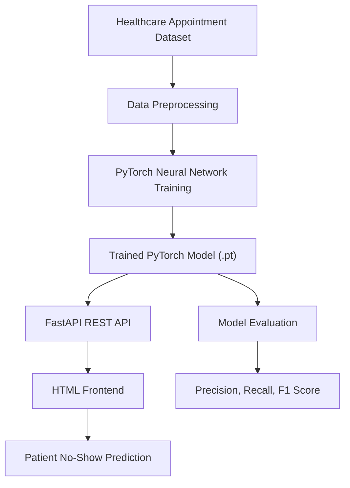

# 🏥 No-Show Predictor (PyTorch)

Predicting patient appointment no-shows using a real healthcare dataset and a PyTorch neural network, with evaluation focused on operational usefulness rather than raw accuracy.
---

## ⭐ Project Highlights

* 🏥 Trained on **110,527** real healthcare appointments
* 🧠 Built a **PyTorch neural network (MLP)** for binary classification
* ⚡ Developed a **FastAPI REST API** for serving predictions
* 🌐 Created a lightweight **HTML frontend** for interactive predictions
* 📊 Evaluated performance using **Precision, Recall, and F1-score**
* 🍎 Optimized training with **Apple Silicon (MPS)** acceleration
* 📦 Supports both **Conda** and **pip** environments
* 🔄 Configured a **Jenkins CI pipeline** for automated builds

---

## 🔍 Problem Statement

Missed appointments disrupt clinical workflows, waste staff time, and increase healthcare costs.

This project explores whether patient demographic and scheduling information can be used to predict appointment no-shows before a scheduled visit, helping healthcare organizations better allocate resources and improve operational efficiency.

---

## 📊 Dataset

* **110,527** healthcare appointments
* **14 predictive features**, including:

  * Age
  * Gender
  * Diabetes
  * Hypertension
  * Alcoholism
  * Handicap
  * SMS reminders
  * Scheduling and appointment dates

**Target Variable**

* Binary classification:

  * Show
  * No-show

> The dataset is naturally imbalanced (~80% show vs ~20% no-show), making Precision, Recall, and F1-score more meaningful than overall accuracy.

---

## 🧠 Model

* Feedforward Neural Network (MLP)
* Implemented using **PyTorch**
* Binary classification with **BCEWithLogitsLoss**
* Trained using **Apple Metal Performance Shaders (MPS)** on macOS

---

## 📈 Evaluation Strategy

Because appointment no-shows are relatively uncommon, overall accuracy alone provides limited insight into model performance.

The project emphasizes:

* Precision
* Recall
* F1-score

Threshold tuning was explored to balance false positives against missed no-show predictions in a realistic healthcare scheduling environment.

---

## 📈 Results

The model successfully learned scheduling patterns from more than **110,000** real healthcare appointments.

Rather than optimizing solely for accuracy, evaluation focused on operationally meaningful metrics suitable for imbalanced healthcare datasets.

The trained model was exported for inference through a FastAPI REST API and integrated with a lightweight HTML frontend for interactive prediction.

---

## 📁 Repository Structure

### Key Files

* `dataset.py` — Data loading, preprocessing, encoding, and train/validation/test splitting
* `model.py` — PyTorch neural network architecture
* `train.py` — Training loop, loss tracking, and model persistence
* `eval.py` — Model evaluation, metrics calculation, and confusion matrix generation
* `eda.py` — Exploratory data analysis for class imbalance and target distribution

---

## 🏗️ System Architecture

## 📸 Screenshots

### Patient Prediction Interface

Interactive HTML application allowing users to enter patient information and receive a predicted appointment no-show risk.

---

### Prediction Output

Example prediction returned by the trained PyTorch model through the FastAPI backend.

---

### FastAPI API Documentation

#### GET Endpoint

Health check endpoint used to verify API availability.

#### POST Endpoint

Prediction endpoint accepting patient information and returning a no-show prediction.

---

### Running API Server

FastAPI development server running locally with automatic reload enabled.

---

## 🔄 Continuous Integration (Jenkins)

A Jenkins pipeline was configured during development to automate project builds and demonstrate familiarity with continuous integration workflows.

---

## ⚙️ Technologies Used

* Python
* PyTorch
* FastAPI
* HTML
* CSS
* JavaScript
* Pandas
* Scikit-learn
* Matplotlib
* Jenkins
* Git
* GitHub

---

## 💡 What I Learned

This project strengthened my experience with:

* Building machine learning models using PyTorch
* Developing REST APIs with FastAPI
* Structuring machine learning applications
* Evaluating imbalanced healthcare datasets
* Using Git and GitHub for version control
* Configuring Jenkins for continuous integration
* Creating reproducible Conda environments

---

## 🚀 Future Improvements

* Deploy the API to cloud hosting
* Replace the HTML frontend with React
* Containerize the application using Docker
* Experiment with XGBoost and LightGBM models
* Add SHAP feature importance visualization
* Expand automated testing within the Jenkins pipeline
